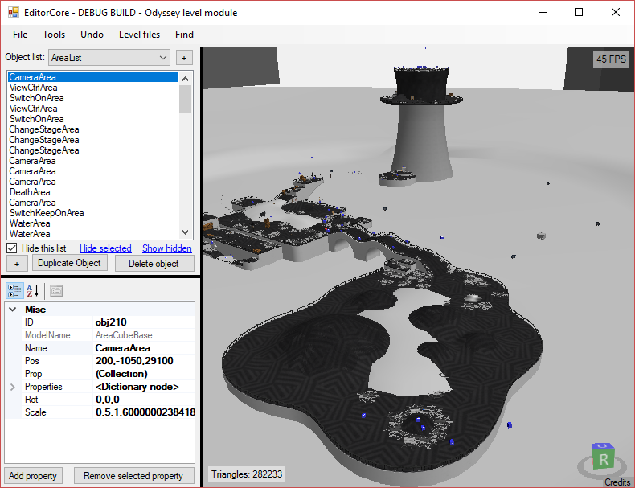

# OdysseyEditor
This is an experimental mario odyssey plugin for [EditorCore](https://github.com/exelix11/EditorCore).
Refer to [EditorCore's readme](https://github.com/exelix11/EditorCore/blob/master/README.md) for the controls and other informations.

## Download
You can download the latest stable build from the releases tab.

## Building
This is just the odyssey plugin, to build you need to download an EditorCore commit that matches the version you want to build (aka if you want to build latest odyssey editor, latest EditorCore should work as they're often committed at the same time).

Download this repo, add it to the EditorCore solution and build.

